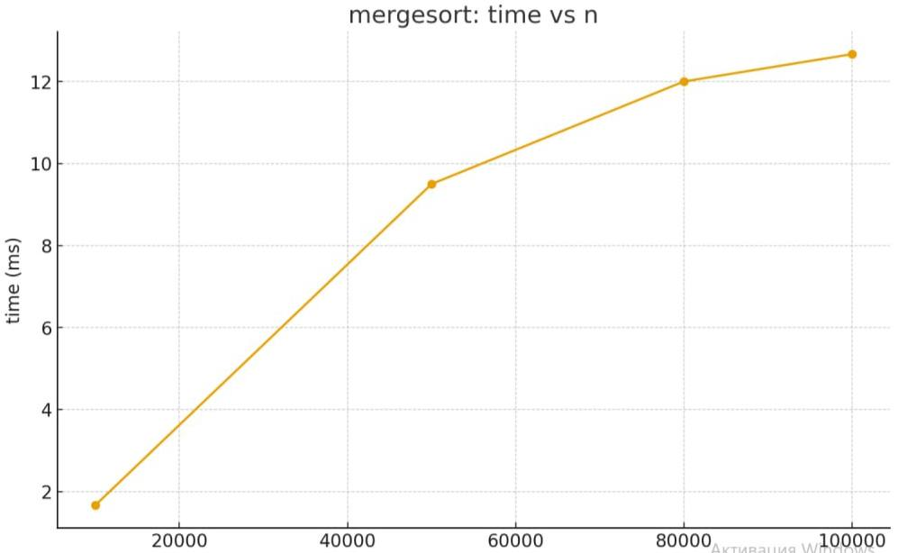

# Design & Analysis of Algorithms — Report

## What’s inside
I wrote four divide-and-conquer algorithms and added simple measurements (time, recursion depth, counters):
- **MergeSort** — linear merge, one reusable buffer, small-n cutoff to insertion sort.
- **QuickSort** — randomized pivot; always recurse into the *smaller* side (so the call stack stays small).
- **Select (Median-of-Medians, groups of 5)** — 3-way partition; recurse only where the k-th can be.
- **Closest Pair (2D)** — sort by *x*, split, check a narrow strip sorted by *y* (compare only a few neighbours).

## How to run
Main class: dsa.cli.Main  (Run - Edit Configurations… - Application)

The program appends rows to `out.csv` with columns:
`algo,n,time_ms,comparisons,swaps,allocations,max_depth,seed,trial`.

## What I measured
- **time_ms** — wall-clock runtime per run
- **max_depth** — maximum recursion depth
- **comparisons, swaps, allocations** — simple counters

## Results 
- **MergeSort** grows ~`n log n`. Example: `n=100k` ≈ 6–23 ms. One buffer → allocations ≈ `n`.
- **QuickSort** average time ~`n log n`. Stack depth stayed small (≈ 10–11 at `n=50–80k`) thanks to “smaller-first”.
- **Select (MoM5)** close to linear time; fewer operations than sorting. Example: `n=80k` ≈ 2–19 ms.
- **Closest Pair** ~`n log n` but with a larger constant factor (example: `n=40k` ≈ 123 ms).

## Plots 

## Why this matches theory
- **MergeSort:** `T(n)=2T(n/2)+Θ(n)` - **Θ(n log n)** (Master, Case 2).
- **QuickSort (randomized):** `E[T(n)]=Θ(n log n)`, depth ~ **O(log n)** with smaller-first recursion.
- **Select (MoM5):** `T(n) ≤ T(n/5)+T(7n/10)+Θ(n)` - **Θ(n)**.
- **Closest Pair:** `T(n)=2T(n/2)+Θ(n)` - **Θ(n log n)**.

## Notes
- MergeSort uses one temp buffer (fewer allocations).
- QuickSort does tail-recursion on the larger side → bounded stack.
- Select uses 3-way partition to handle duplicates cleanly.
- Closest Pair checks only a few neighbours in the strip.

## Conclusion
Results fit the theory: MergeSort and Closest Pair grow about n·log n, Select is close to linear, and QuickSort is n·log n on average with small (log-like) recursion depth. Differences in times are mostly from constants (cache/GC) and random pivots, not from the algorithm order. Overall, the implementations behaved as expected.